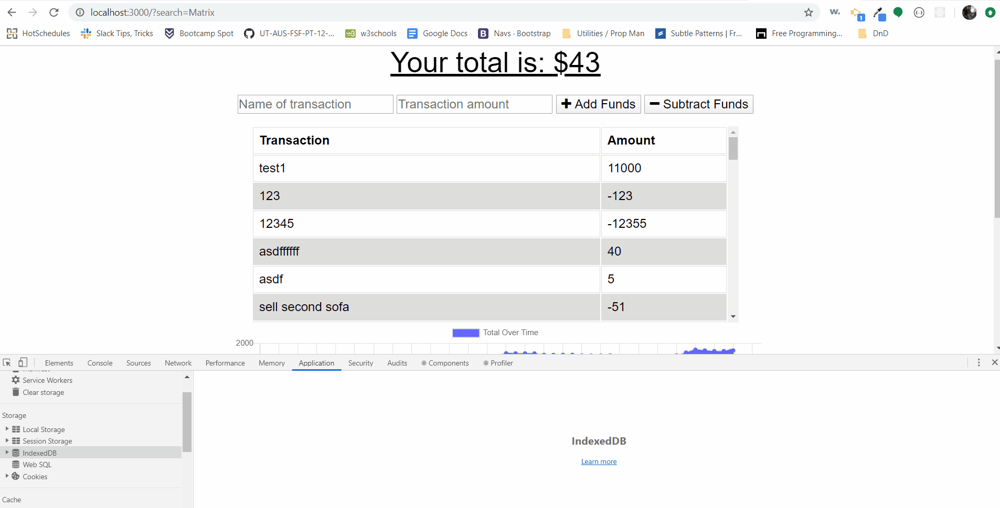

# BudgetTracker
Github: https://github.com/kkwoka/BudgetTracker

Heroku: https://shrouded-mesa-03805.herokuapp.com/
  ​
  ## Description
  ​
  An app for a user to track their money, gained and spent, to get a better idea of their current and/or future budget(s).
  ​
  ## Table of Contents 
  * [Installation](#installation)
  ​
  * [Gif](#Gif)
  ​  ​
  * [Questions](#questions)
  ​
  
  ## Installation
  ​
  To install necessary dependencies, run the following command:
  ```
  npm i
  ```

  ## Gif
  

 
  ## Questions
  ​
  
  ​
  If you have any questions about the repo, contact [kkwoka](https://github.com/kkwoka).